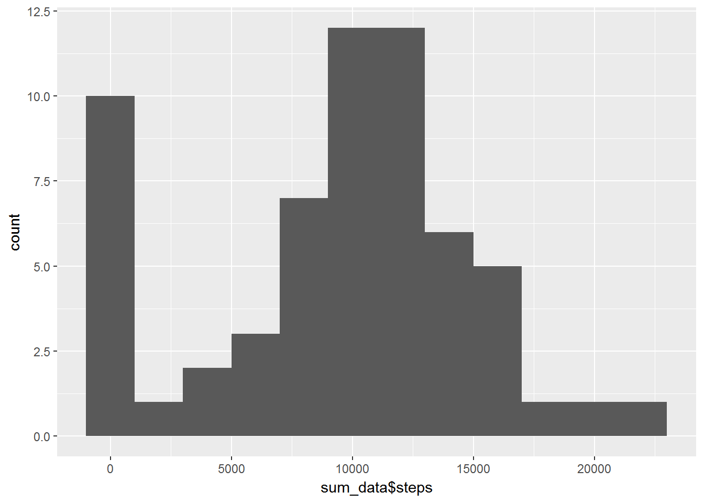
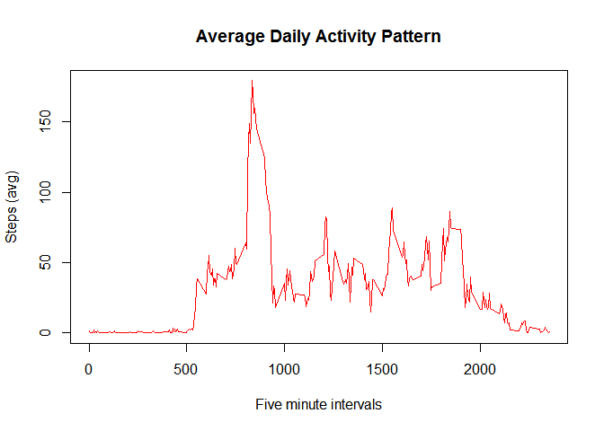
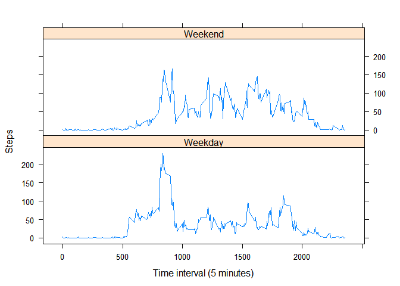

# CS_RR_ReproPresearch_WK2Proj
Brian Gue  
November 19, 2017  
### Question 0. Processing - loading the data


```r
library(dplyr)
```

```
## 
## Attaching package: 'dplyr'
```

```
## The following objects are masked from 'package:stats':
## 
##     filter, lag
```

```
## The following objects are masked from 'package:base':
## 
##     intersect, setdiff, setequal, union
```

```r
library(lattice)
library(ggplot2)

url <- "https://d396qusza40orc.cloudfront.net/repdata%2Fdata%2FStormData.csv.bz2"
# I've downloaded and extracted this file to the following filename
fileanme <- "stormdata.csv"

data <- read.csv("activity.csv", header=TRUE, sep=',')
data_backup <- data # take the original data before manipulating it.

# convert NAs to 0 for step counts
data[is.na(data)] <- 0
```

### Question 1
What is mean total number of steps taken per day?

```r
total <- sum(data$steps)
distinct_dates <- data %>% distinct(date)
mean <- total/count(distinct_dates)
mean
```

```
##         n
## 1 9354.23
```

The mean number of steps is 9354.23.

## Question 2 
Calculate the total number of steps taken per day.


```r
sum_data <- aggregate(. ~ date, data=data, FUN=sum)
sum_data
```

```
##          date steps interval
## 1  2012-10-01     0   339120
## 2  2012-10-02   126   339120
## 3  2012-10-03 11352   339120
## 4  2012-10-04 12116   339120
## 5  2012-10-05 13294   339120
## 6  2012-10-06 15420   339120
## 7  2012-10-07 11015   339120
## 8  2012-10-08     0   339120
## 9  2012-10-09 12811   339120
## 10 2012-10-10  9900   339120
## 11 2012-10-11 10304   339120
## 12 2012-10-12 17382   339120
## 13 2012-10-13 12426   339120
## 14 2012-10-14 15098   339120
## 15 2012-10-15 10139   339120
## 16 2012-10-16 15084   339120
## 17 2012-10-17 13452   339120
## 18 2012-10-18 10056   339120
## 19 2012-10-19 11829   339120
## 20 2012-10-20 10395   339120
## 21 2012-10-21  8821   339120
## 22 2012-10-22 13460   339120
## 23 2012-10-23  8918   339120
## 24 2012-10-24  8355   339120
## 25 2012-10-25  2492   339120
## 26 2012-10-26  6778   339120
## 27 2012-10-27 10119   339120
## 28 2012-10-28 11458   339120
## 29 2012-10-29  5018   339120
## 30 2012-10-30  9819   339120
## 31 2012-10-31 15414   339120
## 32 2012-11-01     0   339120
## 33 2012-11-02 10600   339120
## 34 2012-11-03 10571   339120
## 35 2012-11-04     0   339120
## 36 2012-11-05 10439   339120
## 37 2012-11-06  8334   339120
## 38 2012-11-07 12883   339120
## 39 2012-11-08  3219   339120
## 40 2012-11-09     0   339120
## 41 2012-11-10     0   339120
## 42 2012-11-11 12608   339120
## 43 2012-11-12 10765   339120
## 44 2012-11-13  7336   339120
## 45 2012-11-14     0   339120
## 46 2012-11-15    41   339120
## 47 2012-11-16  5441   339120
## 48 2012-11-17 14339   339120
## 49 2012-11-18 15110   339120
## 50 2012-11-19  8841   339120
## 51 2012-11-20  4472   339120
## 52 2012-11-21 12787   339120
## 53 2012-11-22 20427   339120
## 54 2012-11-23 21194   339120
## 55 2012-11-24 14478   339120
## 56 2012-11-25 11834   339120
## 57 2012-11-26 11162   339120
## 58 2012-11-27 13646   339120
## 59 2012-11-28 10183   339120
## 60 2012-11-29  7047   339120
## 61 2012-11-30     0   339120
```

### Question 3
Make a histogram of the total number of steps taken each day


```r
qplot(sum_data$steps, geom="histogram", binwidth=2000)
```

<!-- -->

### Question 4
Calculate and report the mean and median of the total number of steps taken per day.

```r
summary(sum_data)
```

```
##          date        steps          interval     
##  2012-10-01: 1   Min.   :    0   Min.   :339120  
##  2012-10-02: 1   1st Qu.: 6778   1st Qu.:339120  
##  2012-10-03: 1   Median :10395   Median :339120  
##  2012-10-04: 1   Mean   : 9354   Mean   :339120  
##  2012-10-05: 1   3rd Qu.:12811   3rd Qu.:339120  
##  2012-10-06: 1   Max.   :21194   Max.   :339120  
##  (Other)   :55
```

The mean number of steps is 9354, while the median is 10395. 


### Qeustion 5

```r
dailydata <- data %>%
           group_by(interval) %>%
           summarise(si=mean(steps,na.rm=TRUE))
with( dailydata, plot(interval,si,
                    type="l",
                    col="red",
                    main="Average Daily Activity Pattern",
                    xlab="Five minute intervals",
                    ylab="Steps (avg)")
   )
```

<!-- -->

```r
with(dailydata,interval[which.max(si)])
```

```
## [1] 835
```
The max steps are at 8:35 am - perhaps when people are walking into their offices.

## Imputing Missing Values

### Question 5  
Calculate and report the total number of missing values in the dataset (i.e. the total number of rows with NAs)

```r
sum(is.na(dailydata))
```

```
## [1] 0
```
There are 2304 missing values coded as NA. 

### Question 6
Impute missing step counts. I'll use the average for the corresponding time interval - for example, if  9:05 am value is missing, I'll replace it with the mean for all 9:05 am days that have values.

```r
meanOfNA <- function(x) { 
  ifelse(is.na(x), mean(x, na.rm=TRUE), x) 
}

orig_data <- read.csv("activity.csv", header=TRUE, sep=',')

imputed_data <- orig_data %>%  
  group_by(interval) %>% 
  mutate(steps=meanOfNA(steps)  )

head(imputed_data)
```

```
## # A tibble: 6 x 3
## # Groups:   interval [6]
##       steps       date interval
##       <dbl>     <fctr>    <int>
## 1 1.7169811 2012-10-01        0
## 2 0.3396226 2012-10-01        5
## 3 0.1320755 2012-10-01       10
## 4 0.1509434 2012-10-01       15
## 5 0.0754717 2012-10-01       20
## 6 2.0943396 2012-10-01       25
```

```r
summary(imputed_data)
```

```
##      steps                date          interval     
##  Min.   :  0.00   2012-10-01:  288   Min.   :   0.0  
##  1st Qu.:  0.00   2012-10-02:  288   1st Qu.: 588.8  
##  Median :  0.00   2012-10-03:  288   Median :1177.5  
##  Mean   : 37.38   2012-10-04:  288   Mean   :1177.5  
##  3rd Qu.: 27.00   2012-10-05:  288   3rd Qu.:1766.2  
##  Max.   :806.00   2012-10-06:  288   Max.   :2355.0  
##                   (Other)   :15840
```

```r
sum(is.na(imputed_data))
```

```
## [1] 0
```
There are no remaining NA values 
### Question 7
Make a histogram of the total number of steps taken each day and Calculate and report the mean and median total number of steps taken per day. Do these values differ from the estimates from the first part of the assignment? What is the impact of imputing missing data on the estimates of the total daily number of steps?


```r
sum_data <- aggregate(. ~ date, data=data, FUN=sum)
qplot(sum_data$steps, geom="histogram", binwidth=2000)
```

<!-- -->

```r
summary(sum_data)
```

```
##          date        steps          interval     
##  2012-10-01: 1   Min.   :    0   Min.   :339120  
##  2012-10-02: 1   1st Qu.: 6778   1st Qu.:339120  
##  2012-10-03: 1   Median :10395   Median :339120  
##  2012-10-04: 1   Mean   : 9354   Mean   :339120  
##  2012-10-05: 1   3rd Qu.:12811   3rd Qu.:339120  
##  2012-10-06: 1   Max.   :21194   Max.   :339120  
##  (Other)   :55
```

The values differ from the summary of the dataset above very modestly. This suggests that the imputation strategy was reasonable. 


### Question 8
Are there differences in activity patterns between weekdays and weekends?


### Question 9
Create a new factor variable in the dataset with two levels - "weekday" and "weekend" indicating whether a given date is a weekday or weekend day.
Make a panel plot containing a time series plot (i.e. type = "l") of the 5-minute interval (x-axis) and the average number of steps taken, averaged across all weekday days or weekend days (y-axis). See the README file in the GitHub repository to see an example of what this plot should look like using simulated data.


```r
df <- imputed_data
df$day <- weekdays(as.Date(df$date), abbreviate=FALSE)
#convert day-of-week column vales to Weekday or Weekend
for (i in 1:length(df$day)){
if (df$day[i] == "Saturday" || df$day[i] == "Sunday"){
        df$day[i] <- "Weekend"
} else {
        df$day[i] <- "Weekday" # assumes the rest of the column is complete!
}
}
rm(mean) # remove previous mean object
plot_data <- aggregate(steps ~ interval + day, data = df, mean)

library(lattice)
xyplot(steps ~ interval | day, 
       plot_data , 
       type = "l", 
       layout = c(1,2), 
       xlab="Time interval (5 minutes)", 
       ylab="Steps")
```

<!-- -->
That's not a pretty panel plot , but it provide the comparison. The interpretations are:
 * Participants wake up later on weekends
 * After a flurry of activity during the morning, peaking around 830, participants have a net lower activity level during the remainder of the day on weekdays vs. weekends. 


### Appendix A: Assignment Text 
Document Layout
Assignmentless 
This assignment will be described in multiple parts. You will need to write a report that answers the questions detailed below. Ultimately, you will need to complete the entire assignment in a single R markdown document that can be processed by knitr and be transformed into an HTML file.

Throughout your report make sure you always include the code that you used to generate the output you present. When writing code chunks in the R markdown document, always use echo = TRUE so that someone else will be able to read the code. This assignment will be evaluated via peer assessment so it is essential that your peer evaluators be able to review the code for your analysis.

For the plotting aspects of this assignment, feel free to use any plotting system in R (i.e., base, lattice, ggplot2)

Fork/clone the GitHub repository created for this assignment. You will submit this assignment by pushing your completed files into your forked repository on GitHub. The assignment submission will consist of the URL to your GitHub repository and the SHA-1 commit ID for your repository state.

NOTE: The GitHub repository also contains the dataset for the assignment so you do not have to download the data separately.

Loading and preprocessing the data

Show any code that is needed to

Load the data (i.e. read.csv())
Process/transform the data (if necessary) into a format suitable for your analysis
What is mean total number of steps taken per day?

For this part of the assignment, you can ignore the missing values in the dataset.

Calculate the total number of steps taken per day
If you do not understand the difference between a histogram and a barplot, research the difference between them. Make a histogram of the total number of steps taken each day
Calculate and report the mean and median of the total number of steps taken per day
What is the average daily activity pattern?

Make a time series plot (i.e. type = "l") of the 5-minute interval (x-axis) and the average number of steps taken, averaged across all days (y-axis)
Which 5-minute interval, on average across all the days in the dataset, contains the maximum number of steps?
Imputing missing values

Note that there are a number of days/intervals where there are missing values (coded as NA). The presence of missing days may introduce bias into some calculations or summaries of the data.

Calculate and report the total number of missing values in the dataset (i.e. the total number of rows with NAs)
Devise a strategy for filling in all of the missing values in the dataset. The strategy does not need to be sophisticated. For example, you could use the mean/median for that day, or the mean for that 5-minute interval, etc.
Create a new dataset that is equal to the original dataset but with the missing data filled in.
Make a histogram of the total number of steps taken each day and Calculate and report the mean and median total number of steps taken per day. Do these values differ from the estimates from the first part of the assignment? What is the impact of imputing missing data on the estimates of the total daily number of steps?
Are there differences in activity patterns between weekdays and weekends?

For this part the weekdays() function may be of some help here. Use the dataset with the filled-in missing values for this part.

Create a new factor variable in the dataset with two levels - "weekday" and "weekend" indicating whether a given date is a weekday or weekend day.
Make a panel plot containing a time series plot (i.e. type = "l") of the 5-minute interval (x-axis) and the average number of steps taken, averaged across all weekday days or weekend days (y-axis). See the README file in the GitHub repository to see an example of what this plot should look like using simulated data.
